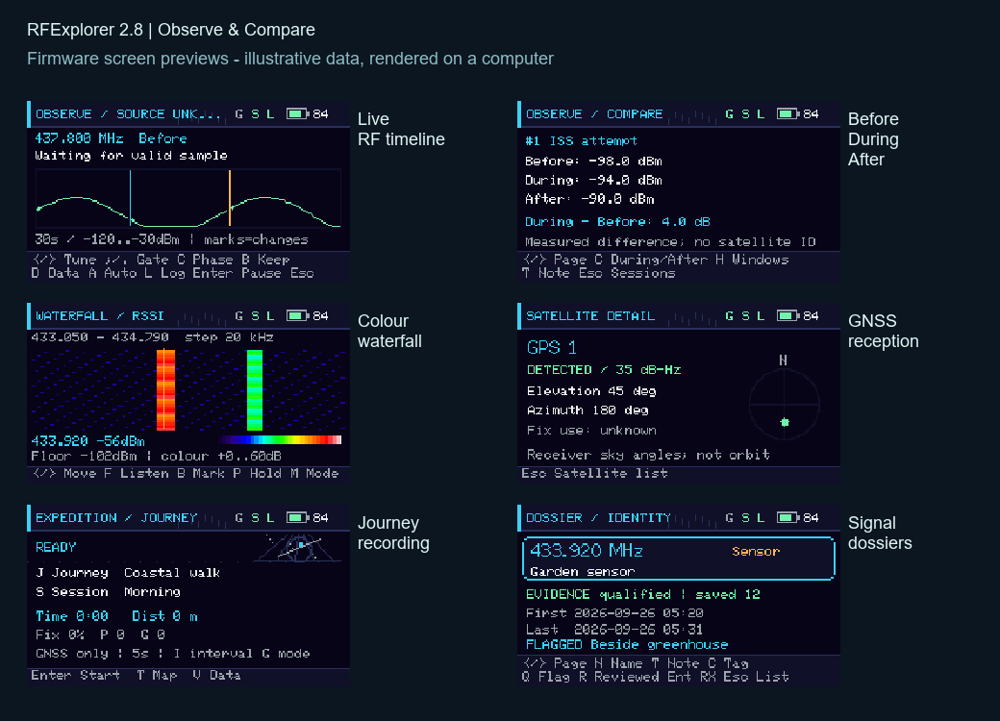
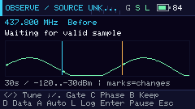
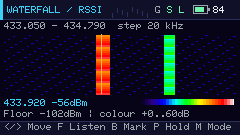
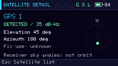
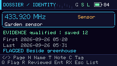

# RFExplorer 2.8 — Observe & Compare


**Receive. Observe. Remember.** Turn your Cardputer ADV into a pocket RF and GNSS field notebook: discover radio activity, investigate saved signals, log satellite reception and compare RF observations across a session.



*These images are rendered from the firmware display code with illustrative test data. They are not photographs or evidence of hardware reception.*

## Get started

You need an **M5Stack Cardputer ADV**, the **CC1101 / NFC Cap (U219)** for RF and NFC features, and a microSD card for persistent records. A supported **M5Stack GPS v1.1 (AT6668) unit** is needed for GNSS, geotags and automatic UTC time.

1. Download [the standalone 2.8 firmware](firmware/RFExplorer-v2.8-cardputer-adv-merged.bin?raw=true).
2. Back up important SD records and power off before fitting accessories.
3. Connect the Cardputer ADV by USB and use an ESP32-S3 flashing tool to write the **merged image at `0x0`**. Enter download mode as described in your Cardputer ADV documentation if needed.
4. Restart, fit the Cap, insert your microSD card and connect GPS for GNSS features. Give the GPS antenna a clear view of the sky.

The [app-only image](firmware/RFExplorer-v2.8-app-only.bin?raw=true) is for `0x10000` with matching bootloader and partitions; use the merged image for a standalone installation. This release is for **Cardputer ADV**, and software validation does not replace testing your individual hardware.

## Explore the features

- **RF:** band scans, fixed monitoring, colour waterfall, finder, fine inspection and conservative evidence gates.
- **Signal Memory:** up to 48 persistent dossiers with notes, investigation flags, history and available receiver geotags.
- **GNSS:** receiver-reported constellation reception, sky positions, satellite logbook, UTC synchronisation and quality diagnostics.
- **Journeys:** named sessions, GNSS breadcrumbs, field bookmarks, gap-aware CSV recording and GPX export.
- **Observe & Compare:** RSSI timelines, named antenna sessions, Before/During/After phases, saved windows and bookmarks.
- **NFC:** explicit read-only tag detection through the supported Cap.

The CC1101 remains receive-only. Swept RSSI is not wideband IQ, protocol decoding or transmitter identification. The experimental ISS-frequency preset is a monitoring target; it does **not** confirm ISS reception. Version 2.8 has a schematic breadcrumb trail; offline map tiles belong to later work.

## Screen previews

| Live timeline | Colour waterfall |
| --- | --- |
|  |  |

| Satellite reception | Signal dossier |
| --- | --- |
|  |  |


Derived from preserved 2.7 source. Receive-only RF, read-only NFC, conservative GNSS detection, travel and discovery functions remain.

## New in 2.8

Open **Satellites → Experimental satellite RF** to explore:

- A live 30-second RSSI timeline. Cyan marks tuning changes; amber marks interruptions or other setting changes. Lines are not joined across gaps over 500 ms. The fixed graph scale is -120 to -30 dBm; values outside it are clipped visually.
- Four saved target profiles: the ISS 437.800 MHz monitoring preset and three editable UHF profiles. Each stores a short source and date-checked label. These are user records, not live operating-status checks or satellite identifications.
- Named SD observation sessions with antenna and notes. Choose Before, During and After phases while recording; recall all saved windows from that session on the Cardputer.
- Up to 32 persistent bookmarks, independent of the rotating 64-window recent history.
- Before/During/After comparisons of sample-weighted window means, subject to conservative compatibility checks. A measured difference does not identify its cause or a satellite.
- Recording diagnostics: sample count, largest gap, excess interval time and the previous window's save duration.

### Controls and storage

In setup, comma/slash switches target and session pages. Target page: F frequency (custom profiles), N name, U source, D date checked, P save profile. Session page: J session name, A antenna, T note. Text fields allow 24 characters. Enter starts a new session. Without SD or after reaching the 12-session limit, monitoring continues **live only**, clearly labelled; it does not save windows.

While monitoring: left/right tunes manually by 1 kHz within ±15 kHz, up/down changes the RSSI gate, Enter pauses, A toggles automatic logging, D switches timeline/quality, C cycles Before/During/After, B bookmarks the last successfully saved window, L stops and opens history, Esc stops and returns. Changes discard partial windows. The receive filter remains 58 kHz. GNSS-only mode prevents RF reception.

In saved sessions, Enter opens the summary; comma/slash switches summary/comparison, C chooses During or After relative to Before, H opens full history, T edits the note. Saved window details have three pages; B bookmarks the displayed record. Antenna context is fixed at session creation: start another session after changing the antenna.

Storage is bounded to **12 named sessions, 4 profiles and 32 bookmarks**; these are not automatically evicted. Each session's append-only `/rfexplorer/observation-<id>.csv` holds its full window history, subject to SD capacity. Recent history `/rfexplorer/satellite-rf-v28.csv` rotates at 64 windows. Metadata and bookmarks use `/rfexplorer/observations-v28.meta` with temporary/backup recovery. Existing v2.7 recent history is read if no v2.8 archive exists; its missing timing/session context stays unknown. Original v2.7 files are preserved. There is no on-device deletion in this release. To start a fresh collection, power off and use a separate prepared SD card, keeping the original card as the archive.

Completed windows require at least ten seconds, 100 samples and no gap above 250 ms. Nominal sampling is 50 ms, not continuous reception. Excess interval time sums delays beyond 50 ms between samples; it is not measured RF duty cycle. SD saving creates additional gaps between windows, reported as prior-save duration but not included in the next window's internal gap statistics. Failed writes are shown; partial windows and uncommitted data can be lost on power failure. Session rows are checksummed and read in sequence; corrupt rows are ignored. Metadata is streamed to avoid a large temporary allocation; history pages are loaded while monitoring is stopped.

Comparisons require a recorded antenna, identical tuning/gate, known timing with maximum gaps no greater than 150 ms and excess interval time no greater than one third of the window, fresh receiver fixes no older than five seconds, HDOP no greater than 3, and receiver positions within approximately 100 m of each phase's first window and between phase references. These are screening heuristics, not proof of identical conditions or positional accuracy. Movement within that tolerance, orientation, interference and rounded per-window means can affect the result. Comparisons are within one session only. Receiver geotags are not satellite positions.

### Independent capture checks

`scripts/compare_captures.py` compares prepared Cardputer CSV (`uptime_ms,rssi_dbm`) with reference CSV (`elapsed_ms,level_dbfs`). Supply separate `--dut-gate` and `--reference-gate` thresholds, and a known `--offset-ms` only when clocks have been aligned. Use `--help` for arguments. No timing offset is guessed. Invalid samples and long gaps break edge continuity; unmatched edge counts block timing comparison. Review the original traces and capture conditions, including frequency, bandwidth, gain, antenna and clipping. This tool does not capture or convert HackRF IQ, equate dBFS with dBm, or calibrate RF accuracy. No physical paired capture has been performed for this release.

Pass prediction, orbital positions, automatic Doppler tracking and satellite decoding/identification remain deferred. The ISS preset is a frequency to investigate, not evidence of ISS reception. Check current [ARISS status](https://www.ariss.org/current-status-of-iss-stations.html) independently. GNSS constellation identifications remain based on supported receiver reports.

## Retained from 2.6: Satellites

Open **Satellites** from the home menu. Each category shows the number currently detected. Enter opens live details; **L** opens the category's SD history. Detection history also recalls all categories together. Use **comma / slash** to switch saved details between the reported sky position and the receiver geotag.

| Category | What it is | Supported receiver signal |
| --- | --- | --- |
| GPS | United States global navigation constellation | L1 |
| GLONASS | Russian global navigation constellation | R1 |
| Galileo | European global navigation constellation | E1 |
| BeiDou | Chinese global navigation constellation; generations are not guessed from IDs | B1I / B1C |
| QZSS | Japanese regional navigation and augmentation constellation | L1 |
| SBAS | Satellite-based navigation augmentation; availability is regional | L1 |

These capabilities come from [M5Stack's GPS v1.1 specification](https://docs.m5stack.com/en/unit/Unit_GPS_v1.1). ID ranges and signal fields follow the [CASIC receiver protocol linked by M5Stack](https://m5stack-doc.oss-cn-shenzhen.aliyuncs.com/1173/CASIC_Multi-mode_Satellite_Navigation_Receiver_Protocol_Specification.pdf). Reception depends on antenna placement, sky visibility, region and the receiver's enabled modes. The app does not enable additional modes automatically or promise simultaneous reception of all systems.

**Detected** means a checksum-validated, complete receiver GSV cycle reports a supported constellation/ID/signal with positive C/N0, no more than three seconds old. C/N0 is shown in **dB-Hz**, not RSSI or a confidence percentage. This is receiver-reported reception, not independent authentication. Blank/zero C/N0, unknown talkers, unsupported IDs/signals and stale reports cannot become new detections. Missing signal IDs are accepted for known constellations without claiming a particular signal band. Raw reports remain available for diagnostics. A listed satellite is not necessarily tracked or used in a position fix.

**Position** means reported azimuth/elevation in the receiver's sky, with north at the top. Missing angles remain unknown. The separate saved latitude/longitude is the **receiver's position at a valid detection fix**, never the satellite's geographic position. No orbit propagation or satellite latitude/longitude is invented. Live detail retains its selected identity if reception stops.

**Logging:** `/rfexplorer/satellite-log-v26.csv` stores up to 192 constellation-plus-ID records, qualified report counts, first/last detection UTC, last C/N0, sky angles, signal ID, fix-use state and the last valid receiver geotag. Counts are receiver reports, not distinct visits or packets. New records save immediately; repeat updates flush every 30 seconds, so abrupt power loss can lose that interval. Save failures are shown. UTC remains unknown until available; an earlier unknown timestamp is never backdated. The archive is an aggregate logbook, not a full per-report trajectory. Older v21/original files are preserved; legacy sightings remain unverified until freshly received under the new rules, and do not inflate qualified counts. There is no automatic eviction at capacity.

The CC1101 is a sub-GHz RSSI receiver in this application, not a satellite identity decoder. No ISS, weather-satellite, Starlink or other generic RF satellite-detection categories are included. [TI's CC1101 specification](https://www.ti.com/product/CC1101) describes its hardware limits.

Non-RF journal frequency/RSSI fields are blank. GNSS quality history leaves missing C/N0 as gaps and stale HDOP unknown. The SD archive warns when full. Additional accuracy fixes reject implausible RF readings, keep weak continuation windows below the 10 dB qualification margin out of saved activity, prefer fresh satellite reports over stale stronger ones, reject duplicate IDs within a GSV cycle, and keep ambiguous GSA membership unknown. These are software safeguards, not a calibration or guarantee that every received signal can be identified.

## Retained from 2.5

- **Reference freshness:** quiet-reference age follows actual eligible samples, rather than repeatedly refreshing from old values. Updates need new quiet samples; the reference is frozen during detected activity, upward adjustment is limited to 1 dB per update, and a 10-second age is shown as stale. New bursts do not start on a stale reference.
- **Measured timing diagnostics:** mean/max sampling interval, intervals over 20 ms, maximum display work time and save/recorder-section work time. Values are measured on the running device, not performance promises. Detailed monitoring redraws every 140 ms, or 250 ms during activity, rather than 70 ms; sampling still shares the main loop and SPI bus.
- **Sustained activity:** five-second sampled windows above an established quiet reference can be saved separately from bursts. They need at least 80% short-gap sampling coverage, at least 100 samples and no single gap over 250 ms. `ACTIVITY_WINDOW` CSV rows and separate activity dossiers retain these observations. Counts are saved windows, not packets, individual transmitters or distinct emissions. Same-frequency activity windows share a dossier; this does not establish identity.
- **Independent investigation flags:** Q toggles a flag without changing Sensor/Remote/etc. R toggles Reviewed. A flag takes priority; reviewed records otherwise leave the automatic suggestion list. Legacy unverified records can be flagged without promoting their evidence.
- **Encounter context:** a fifth dossier page recalls available receiver latitude/longitude, fix age, HDOP, RX filter bandwidth, sampling coverage and quiet-reference age alongside the encounter UTC. Missing or legacy values remain unknown. Burst context is frozen at completion, so a later manual save cannot substitute a new position.
- **Clearer Fine Scan wording:** a repeatable sampled peak is not an exact transmitter-frequency measurement. The 5 kHz tuning grid does not establish 5 kHz accuracy through the 58 kHz filter.

## Using Fieldwork

1. Start Fixed Monitor, then use **P Fine** to enter Fine Scan and detailed inspection. Activity windows and the new reference estimator operate in this detailed mode, not the basic 50 ms monitor or a band sweep.
2. Let the relative reference initialise while the channel is quiet if possible. In Inspector, **D** opens diagnostics; `,` / `/` changes its two pages. **N** relearns the reference, **C** captures a raw trace, **X** exports it and pauses RF, **Enter** pauses/resumes, **Esc** returns.
3. With automatic logging enabled, completed qualified bursts and accepted activity windows are saved. Trace capture suppresses both automatic saves. SD writes can still interrupt sampling.
4. Open **Signal Memory → Investigate / saved signals**. **I** opens a dossier, **Enter** retunes, **O** sorts. In a dossier, **Q** flags, **R** marks reviewed, **C** changes category, **N/T** edit name/note, and left/right changes pages. Up/down selects a saved encounter on History or Context.

Suggestions include flagged records, unreviewed qualified Unknown bursts, sustained activity windows, and baseline RSSI changes. They are review hints, not proof of interference or signal identity. Existing baseline comparisons are still limited: antenna/setup and place compatibility are not enforced; compare like-for-like manually.

## Measurement limits

Burst qualification retains the 2.4 rules: 10 dB start margin, 6 dB continuation margin, at least 3 high samples over 4–65,535 ms, no internal gap above 20 ms, and completion after 12 ms without a high sample. The reported span is sampled, not calibrated pulse width. Missing/legacy evidence cannot generate a strong match; comparisons occur before insertion, and repeated saves of one burst do not add sightings.

The initial quiet reference is a lower-percentile estimate, not proof of an empty channel. A signal present throughout initialisation can become the reference. Sustained interference cannot be distinguished automatically from a changed background; stale references remain visible, and N offers explicit relearning. Ongoing activity windows retain their older reference age; a long interruption ends continuity. Very short signals can be missed.

Sampling coverage is the fraction of a window accounted for by adjacent sample intervals of at most 20 ms. It is not continuous RF coverage, packet reception percentage or proof that energy persisted between samples. Burst context uses 100% for its accepted short-gap span, not 100% capture of the transmission. RSSI reads need not be statistically independent. No new hardware settling/AGC settings or RF calibration are claimed.

Locations are receiver positions near observation completion, not transmitter positions. UTC is only as good as the currently set system clock; fix age/HDOP describe the available GNSS data and do not guarantee metre-level accuracy. Existing GNSS freshness and invalid-solution checks remain.

Raw diagnostic capture remains bounded to 1,024 sampling attempts. Exported CSV files are under `/rfexplorer/diagnostics/`. `python scripts/replay_trace.py "path/to/trace.csv"` replays the burst detector; the activity-window and reference logic have separate host tests. None of these tests replaces physical RF comparison.

## Hardware you need

- **M5Stack Cardputer ADV** (ESP32-S3, 8 MB flash).
- **Cap CC1101/NFC U219** for RF and NFC, plus an appropriate antenna on its RP-SMA connector.
- **GPS v1.1 / AT6668** for GNSS, through Grove UART: RX GPIO 1, TX GPIO 2, 115200 baud, 8N1.
- A microSD card for persistent logs and discoveries, and a USB data cable for installation.

## Install

1. Back up anything you want to keep. Copying a `.bin` onto the SD card alone does not install it.
2. Connect the Cardputer ADV by USB. If the flashing tool cannot connect, use the board's boot/reset controls to enter download mode.
3. In your ESP32 flashing tool, select ESP32-S3, the correct serial port and **`RFExplorer-v2.8-cardputer-adv-merged.bin`**. Write at **`0x0`**. This includes the bootloader, partition table and application.
4. Restart; the startup screen should identify **2.8 Observe**.

With esptool installed, an equivalent command is:

```powershell
python -m esptool --chip esp32s3 --port COM5 write_flash 0x0 firmware/RFExplorer-v2.8-cardputer-adv-merged.bin
```

Replace COM5 with your device's port. The **app-only** image belongs at **0x10000** and needs a matching bootloader and partition layout. Use the merged file for a complete installation. Firmware installation does not erase the SD card; keep a backup before testing a new release.

## Controls

Use `;` / `.` or arrows to move, **Enter** to open, and **Esc** / backtick to return. Submenus remember their position during the current boot.

In **GNSS & Travel → Expedition / journeys**:

| Key | Action |
|---|---|
| Enter | Start / finish recording |
| J / S | Rename journey / session while stopped |
| B | Add a field bookmark while recording |
| I | Cycle recording interval while stopped |
| G | Toggle GNSS-only mode |
| T | Breadcrumb trail |
| V | Live travel data |

Journey/session names persist. Interval, operating mode and menu selection reset on reboot. Recording continues while browsing other screens. Finish before removing power or the SD card. Each journey row is flushed and closed, although an interrupted write can still leave a partial final row. Recovery marks the interruption instead of continuing across reboot. If recovery fails, restore the original card and reboot; the pending path is preserved.

Header **G** means fresh fix, **S** general SD logger and **L** automatic logging. Check the Expedition screen for recorder-specific errors. Battery percentage remains an estimate, not a calibrated remaining-runtime measurement.

## Features retained

Band scanning, fixed monitoring, colour waterfall, signal finder, RF catalogue, frequency bookmarks, Signal Hunt, Signal Watch and GNSS-linked survey. The waterfall is sequential swept RSSI, with 32 colours spanning 0–60 dB above the sweep floor.

Discovery Memory stores up to 48 dossiers with labels, notes, saved encounters, UTC where known, fingerprints, tentative families and user-captured baselines. `I` opens a dossier; `O` changes list sorting. Dossier pages distinguish measurement from inference. Similarity and families do not identify transmitters or decode protocols.

The satellite logbook retains first/latest valid **receiver** locations, reported IDs and signal information. Geotags say where the receiver observed the satellite, not where the satellite is. Valid GNSS RMC/ZDA time synchronises the UTC clock after boot.

NFC performs explicit read-only Type-A detection/select operations and disables its field afterwards. Field Journal records cumulative RF summaries for the current boot.

## Journey files and GPX

Sessions are stored under `/rfexplorer/expeditions/<journey>/` on the SD card. Rows include START, POINT, GAP, BOOKMARK, END and RECOVERED. END stores elapsed time, estimated distance, counts and the percentage of scheduled samples with a fresh fix.

Copy a CSV to your computer and run with Python 3:

```powershell
python scripts/export_journey.py "C:\path\to\session.csv"
```

This writes a GPX next to the CSV using only Python's standard library. Unknown altitude/time is omitted; unlocated bookmarks remain in the CSV; gaps split the track. The original CSV is preserved.

Distance excludes gaps, stationary/slow reports, poor or missing HDOP, and implausible jumps. It can undercount, particularly at short intervals or without motion/quality reports. GPX preserves the recorded fresh positions rather than applying this distance filter. Neither is a surveyed route or navigation guarantee.

Discovery Memory writes `/rfexplorer/signal-memory-v25.csv`, with temporary/backup files for replacement recovery. It imports v24, v20, v19 or the original CSV without overwriting them. v24 qualified burst evidence stays qualified; older unknown evidence stays unverified. Old Interesting categories become investigation flags without changing the category. Missing historical encounter context stays unknown. New entries and edits save immediately; repeated encounters and journal summaries can lag by 30 seconds on abrupt power loss. The working store remains 48 dossiers with 12 recent encounters each; full stores do not evict records. Arbitrary historical CSV logs are not imported.

## Limits and future work

CC1101 stays receive-only, within its supported 300–348, 387–464 and 779–928 MHz bands. It is not a wideband IQ receiver. No protocol decoding, LoRa, ADS-B, VHF airband, transmitter identity, bearing or calibrated occupied-bandwidth measurement is claimed.

Per-journey satellite encounter rollups, an offline geographic basemap, automatic dimming and a journey-history browser are not included. The breadcrumb trail is a schematic, in-memory view. Reception inside buildings/vehicles depends on the antenna's view of the sky. GNSS-only mode is not airline permission to operate equipment.

## Build and checks

Run `pio run -e cardputer_adv` from this folder, or `BUILD_2_8.ps1`. Pinned dependencies are in `platformio.ini`; downloaded library sources are not patched. Packaging generates:

- `firmware/RFExplorer-v2.8-cardputer-adv-merged.bin` — **0x0**.
- `firmware/RFExplorer-v2.8-app-only.bin` — **0x10000**, matching layout required.
- `firmware/manifest.json` — image sizes, hashes and offsets.
- `firmware/source-sha256.json` — source provenance.

Python checks: `tests/run_host_tests.py`, `tests/test_export.py`, `tests/test_replay.py`, `tests/test_integration.py`, `tests/render_ui.py`, `tests/validate_release.py`. Host C++/render checks use the Visual Studio Build Tools path in their scripts; renders also need Pillow and resolved M5GFX fonts. See the delivered build report for results. Software checks do not replace physical Cardputer testing.

## Contact

Feature requests, technical questions or issues: **[octofuzz@gmail.com](mailto:octofuzz@gmail.com)**. Include your firmware version, hardware setup and steps to reproduce the issue.
